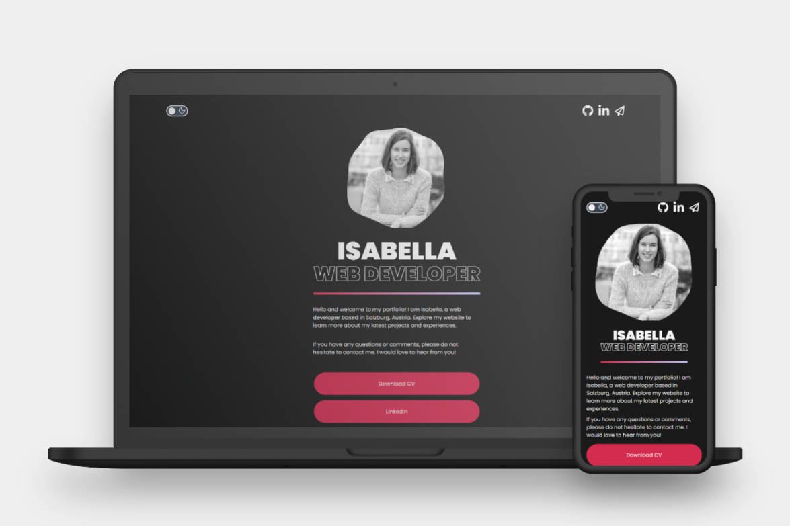

# Portfolio Website



## Project Description
This repository contains the code for my portfolio website, which you can find at [https://isabella-molterer.com/](https://isabella-molterer.com/).
The project aims to create a professional and simple website that showcases my work and makes it easy to get in touch with me.
The portfolio website includes a linktree with links to valuable resources and ways to contact me via email or other platforms. 
It also includes links to my CV, public GitHub profile, and other social media profiles, such as LinkedIn and Instagram.
The web portfolio is still a work in progress and will continue to grow over time.

## Project Requirements
The website is developed using the Nuxt 3 Minimal Starter, with Typescript for strong typing and SCSS for styling.
Look at the [Nuxt 3 documentation](https://nuxt.com/docs/getting-started/introduction) to learn more.
Basic SEO measures were taken to optimize the website's search engine ranking. The website's responsive design is based on my own concept and preferences, with consideration for modern design trends and best practices for user experience.
The website is hosted and deployed using Netlify and GitHub branching logic. 

<table>
  <tr>
    <td style="border:none;"></td>
    <td style="border:none;"></td>
    <td style="border:none;"></td>
    <td style="border:none;"></td>
    <td style="border:none;"></td>
    <td style="border:none;"></td>
  </tr>
</table>


## Project Setup

Make sure to install the dependencies:

```bash
# npm
npm install
```

## Development Server

Start the development server on http://localhost:3000

```bash
npm run dev
```

## Production

Build the application for production:

```bash
npm run build
```

Locally preview production build:

```bash
npm run preview
```

Check out the [deployment documentation](https://nuxt.com/docs/getting-started/deployment) for more information.

## Linting

Perform linting with [ESLint](https://eslint.org/) and format code with [Prettier](https://prettier.io/)

```bash
npm run lint
```
